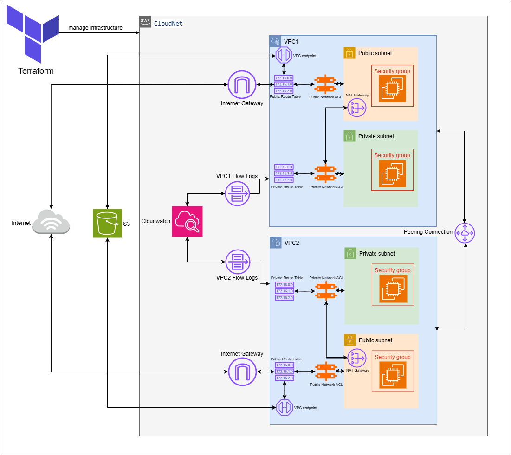

# 🌐 CloudNet - Dual VPC AWS Infrastructure



A **Terraform** project that automates the deployment of a dual-VPC architecture on AWS, including peering, centralized storage, and monitoring features.

---

## 🚀 Features

- ✅ Two isolated VPCs (public/private subnets)
- 🔁 VPC Peering connection
- 🌐 NAT Gateways for internet access in private subnets
- 📦 Centralized S3 bucket via VPC endpoints
- 📊 VPC Flow Logs for traffic monitoring
- 🔐 Security Groups with least-privilege access
- 🌍 Highly available across multiple Availability Zones (AZs)

---

## ✅ Prerequisites

### 🔐 AWS Account
Permissions to create:
- VPCs, subnets, route tables
- EC2 instances, S3 buckets
- IAM roles and policies

### 🖥️ Local Setup
- [Terraform v1.0+](https://learn.hashicorp.com/tutorials/terraform/install-cli)
- [AWS CLI](https://docs.aws.amazon.com/cli/latest/userguide/cli-configure-quickstart.html)
- Git installed

---

## ⚙️ Deployment Steps

### 1. Clone the repository

```bash
git clone https://github.com/yourusername/cloudnet-dual-vpc.git
cd cloudnet-dual-vpc

## 2. Configure AWS credentials

Ensure your AWS credentials are set either via:
```bash
aws configure
